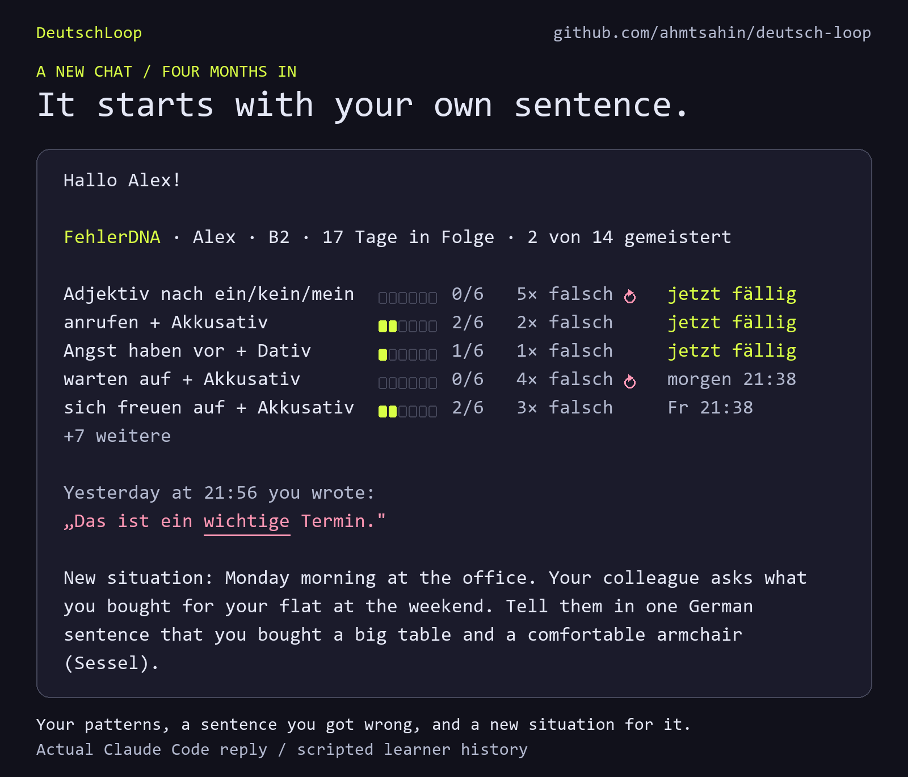
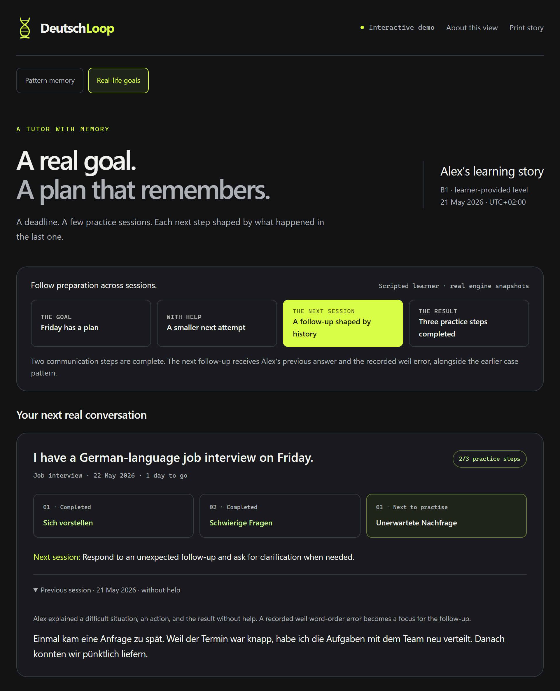
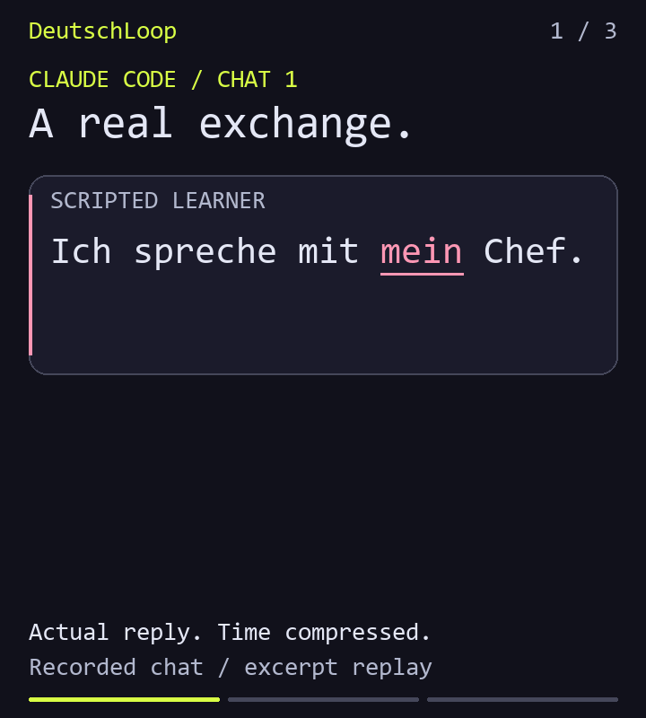
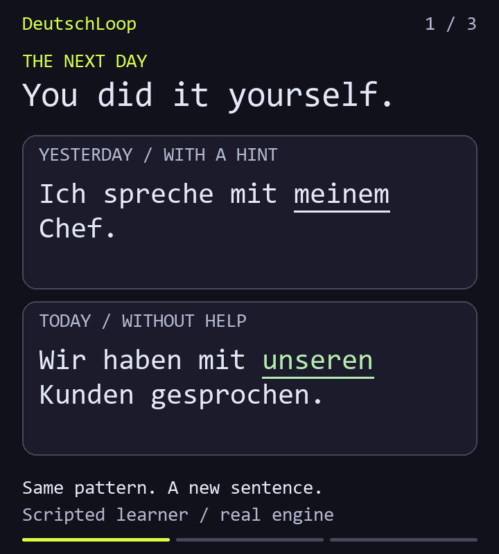
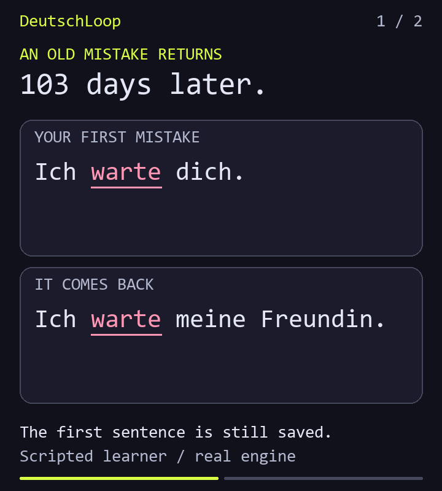
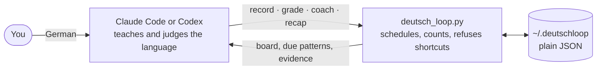

# DeutschLoop

**A German tutor that remembers your mistakes.**

It runs inside Claude Code and Codex. Every mistake is filed under its root cause and comes back in a new sentence until it stops. Your history stays on your own machine, and there is no extra API key.

[](https://github.com/ahmtsahin/deutsch-loop/actions/workflows/tests.yml)


[](LICENSE)

<p align="center">

</p>

**A new chat, four months in.** The tutor shows what is due, quotes a sentence you got wrong yesterday, and asks for a new one. This is an actual Claude Code reply to a scripted learner with four months of history. [Read the whole session](demo/session.md).

[Goal-preparation demo](#goal-preparation-demo) · [Pattern-memory demo](#explore-your-learning-story) · [Install](#install) · [Why not just a chatbot?](#why-not-just-ask-a-chatbot) · [How it works](#how-it-works)

## Goal-preparation demo

Open **[demo/missions.html](demo/missions.html)** in your browser after cloning or downloading the repository. This is the **Real-life goals** demo: it follows a Friday job interview across scenes, from a hinted introduction to difficult questions and an unexpected follow-up shaped by the previous answer.

<p align="center">
<a href="demo/missions.png"></a>
</p>

**Preparation that carries over.** Two communication tasks are complete; the next scene receives the previous answer and its recorded error. Screenshot of the demo with a scripted learner and scripted assessments, backed by real engine snapshots.

## Explore your learning story

Open **[demo/index.html](demo/index.html)** for the separate **Pattern memory** demo. Choose a pattern to see its first mistake, the hint that helped, and a later unaided sentence. Move between four days to watch a mistake return with its memory intact. Search sentences, filter grammar families, or open the saved timeline.

Both demos are self-contained offline HTML files: no installation, account, API key, or server is needed to open them. Both include fifteen roleplay frames with example situations and opening lines. Alex's messages are scripted; each day's counts, schedules, and learning milestones are captured from the real engine before later events happen. GitHub's file viewer shows HTML source; download the files to interact with the example histories.

For your own saved learning history:

```bash
python scripts/deutsch_loop.py dashboard --output my-progress.html
```

Open the resulting file in your browser. It contains your exported sentences, stays offline, and leaves your learning records and review schedule unchanged. Export again to refresh it; replacing an existing HTML file requires `--force`. [Dashboard guide](docs/dashboard.md).

## Install

Requires **Python 3.10+** and Claude Code or Codex. No runtime packages, extra API key, server, or database to set up. Your existing model teaches; progress is stored locally in `~/.deutschloop`.

**Claude Code**

```bash
git clone https://github.com/ahmtsahin/deutsch-loop.git "$HOME/.claude/skills/deutsch-loop"
```

Start a chat with **`/deutsch-loop`**.

**Claude Code, as a plugin**

```bash
claude plugin marketplace add ahmtsahin/deutsch-loop
claude plugin install deutsch-loop@deutsch-loop
```

Start a chat with **`/deutsch-loop:deutsch-loop`**.

**Codex**

```bash
git clone https://github.com/ahmtsahin/deutsch-loop.git "$HOME/.agents/skills/deutsch-loop"
```

Start a chat with **`$deutsch-loop`**.

**Codex, as a plugin**

```bash
codex plugin marketplace add ahmtsahin/deutsch-loop
codex plugin add deutsch-loop@deutsch-loop
```

Start a new chat with **`$deutsch-loop:deutsch-loop`**.

The tutor gives you one small German task right away. You can ask for explanations in your own language. Your name and goals are optional.

The commands work in macOS/Linux terminals and PowerShell. Use either the cloned folder or the plugin, so that the skill appears once. For project-only installation, Python on Windows, or the one-time permission setup that lets the tutor save progress, see [installation and permissions](docs/setup.md). Used it under its old name, DeutschDNA? Your progress carries over; [here is what changes](docs/setup.md#installed-under-the-old-name-deutschdna).

## Why not just ask a chatbot?

You can, and the correction will be fine. Then the chat ends. Next week you write *mit mein Chef* again, and nothing notices.

| | A chat on its own | With DeutschLoop |
| --- | --- | --- |
| Your mistake | Corrected once | Filed under its root cause, with your sentence and the date |
| What you practise | Whatever you ask for | What is due: a pattern returns after 1, 3, 7, 14, 30, and 60 days |
| The exercise | Often the sentence you just saw | A new situation every time; repeats are refused |
| The hint that worked | Gone with the chat | Saved for the next time you are stuck |
| “You have improved” | Easy to say | Needs a new sentence, without help, on a later day |
| The record | Wherever the chat product keeps it | Plain JSON in `~/.deutschloop` that you can read, copy, or delete |

## What happens when you answer

The same recorded session, one message later:

```text
You     Ich habe einen großen Tisch und einen bequemen Sessel gekauft.

Tutor   Correct, with no help: einen großen Tisch and einen bequemen Sessel
        both carry the right ending.

        Yesterday: „Das ist ein wichtige Termin." · Today: „Ich habe einen
        großen Tisch und einen bequemen Sessel gekauft." ✓

        That pattern moves up to step 1/6 and comes back on Friday at 22:39.
```

Once a week, or when you ask “How am I doing?”, you get your FehlerDNA profile:

```text
FehlerDNA · Alex · B2
14 Muster · 2 gemeistert · 29× falsch · 72× richtig · 17 Tage in Folge · 2 fällig

Artikel         ████████░░  78%   1 Muster  · 1 gemeistert · 1× falsch · 6× richtig
Kasus           ████████░░  77%   4 Muster  · 1 gemeistert · 6× falsch · 22× richtig
Präpositionen   ███████░░░  69%   4 Muster  · 0 gemeistert · 10× falsch · 24× richtig
Wortstellung    ██████░░░░  64%   2 Muster  · 0 gemeistert · 3× falsch · 6× richtig
Endungen        ██████░░░░  57%   2 Muster  · 0 gemeistert · 8× falsch · 11× richtig   ← schwach
Plural          ███████░░░  67%   1 Muster  · 0 gemeistert · 1× falsch · 3× richtig

Ursache: Präpositionen · 5 von 15 Fehlern der letzten 30 Tage · 4 verwandte Muster
  → sich freuen auf + Akkusativ
  → warten auf + Akkusativ
  → sich interessieren für + Akkusativ
  → Angst haben vor + Dativ
```

The tutor reads it for you, in the language you chose:

> **Biggest root cause: verbs with fixed prepositions.** Four related patterns (*sich freuen auf, warten auf, sich interessieren für, Angst haben vor*) produce another 5 of those 15 mistakes. The issue is remembering which preposition and case each verb takes, so it is worth practising them as a family.

Both excerpts are shortened from the recorded session; the tutor's words are unchanged.

## The engine keeps the tutor honest

Language models are generous graders. Here the model teaches, and a small local program keeps the books. It decides what is due and what counts, and it refuses shortcuts. These are its actual replies:

```text
A review before its due date
→ This pattern is not due; use coach for practice without advancing the schedule

An answer you have written before
→ This answer was already seen; test transfer with a new sentence

The same exercise a second time
→ This review prompt was already used; ask a new situation

A pass, although you needed a hint
→ A hinted answer cannot pass; use hard or coach
```

A pattern is mastered after six passed reviews. A failed review sends it back to the first step. If the tutor got it wrong, “That wasn't a mistake” undoes the correction and restores the schedule.

## What you can do

| Say this | What happens |
| --- | --- |
| “Correct my German.” | Minimal corrections, with related mistakes grouped by their root cause. |
| “Give me a hint.” | You repair the sentence; the tutor remembers the help you needed. |
| “Let's review.” | Due patterns return in fresh situations. Copying the old answer cannot advance mastery. |
| “I have a meeting tomorrow.” | A roleplay can use your goal and a pattern you are practising. |
| “I have a German job interview on Friday.” | A saved three-step preparation plan, adapted across scenes and chats to your actual answers, help used, and recorded mistakes. |
| “Continue my interview preparation.” | Resume the current scene, unfinished assessment, or next communication task. |
| “Let's practise words.” | Vocabulary from your scenes returns in spaced reviews. |
| “How am I doing?” | Your recorded progress, with the sentences behind it. Ask for a visual view to get an offline, interactive learning story. |
| “That wasn't a mistake.” | The tutor can undo the correction and restore its schedule. |

During a roleplay, ordinary corrections wait until the debrief. Start with “Restoranda konuşalım” or “Roleplay Restaurant”; finish with “bitir” or “stop roleplay”. The reply includes up to three corrections and useful vocabulary.

There are fifteen roleplay frames, including interviews, presentations, train travel, hotels, a public office, phone appointments, shopping, school, and customer service. [Example requests for every frame](docs/practice.md#more-roleplay-situations) · [Continuing preparation for a real event](docs/missions.md).

[Your first minute, roleplays, and more examples](docs/practice.md).

## One mistake over time

<table>
<tr>
<td width="330"></td>
<td><b>The first day: a hint, not the answer.</b><br>You repair the sentence yourself. A new chat remembers the hint that helped.<br><br>Actual Claude Code replies. <a href="demo/conversation.md">Full conversation</a> · <a href="demo/conversation.png">Static view</a></td>
</tr>
<tr>
<td width="330"></td>
<td><b>The next day: a new sentence, without help.</b><br>Yesterday you needed the hint. Today the same pattern works in a sentence you have never written.<br><br>Scripted learner, real engine. <a href="demo/learning-loop.png">Static view</a></td>
</tr>
<tr>
<td width="330"></td>
<td><b>103 days later: the mistake returns.</b><br>Your first sentence, its correction, and the hint that helped are still there.<br><br>Scripted learner, real engine. <a href="demo/history.png">Static view</a></td>
</tr>
</table>

## How it works



- **The skill** is [`SKILL.md`](SKILL.md) and eight [references](references): how to correct minimally, when to give a hint instead of the answer, how to continue real-life preparation, and what may be claimed about progress.
- **The engine** is one Python file with no dependencies, plus a bundled scenario catalog and dashboard template. It stores patterns and preparation plans, schedules reviews, remembers helpful cues, supports undo, and exports an offline dashboard. More than 140 tests run on Linux, macOS, and Windows.
- **The catalog** names [about a hundred root causes](references/patterns.md) of typical mistakes, so that *mit mein Chef* and *mit meine Schwester* count as one problem and not two.
- **Nothing else.** No account, server, or telemetry. Your messages go to the model you already use, as in any other chat there. Only the memory is new, and it is a folder of JSON files.

## Try the engine

From the cloned skill folder, without an agent:

```bash
python scripts/demo.py --learning-loop
```

This uses a fresh demo directory. For the four-month story, run `python scripts/demo.py`; for the restaurant scene, add `--speak`.

[CLI guide](docs/cli.md) · [Command contract](references/cli-contract.md) · [Tests, recording, and image generation](docs/development.md)

## About the demos

Learner messages are scripted so that every demo can be reproduced. The opening image and the first-day story show actual Claude Code replies. They were recorded under the project's old name, DeutschDNA, and only the name was changed afterwards; the board in the opening image now reads FehlerDNA. Boards, dates, counts, and histories come from the engine. The four-month history is seeded through the engine by `scripts/demo.py`; nobody waited four months for it.

The first example and teaching milestones survive the rolling history limits. Progress scores describe tracked patterns, not overall German proficiency. Text practice works directly; microphone capture and pronunciation scoring are not included.

## Contributing

The easiest place to help is the [pattern catalog](references/patterns.md). It has notes on typical mistakes for speakers of Turkish and English. If your first language leads to a German mistake that is missing, open an issue with two example sentences.

## Roadmap

- Available: three-step preparation for real-life goals across scenes and chats, with fifteen roleplay frames.
- Planned: Goethe B1/B2, telc B1/B2, and telc Deutsch Beruf exam modes.
- Available: an offline local dashboard and an interactive example history.
- Exploring: voice practice and pronunciation fingerprint.

## License

[MIT](LICENSE)
